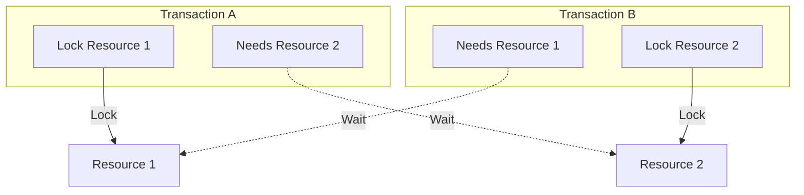

Let's delve into the realm of concurrency a crucial consideration for every developer crafting services. Concurrency can often lead to unexpected issues when developing services which can cause problems when we least expect them. Therefore, it's essential to treat concurrency with the utmost importance during development.

Concurrency can be managed using two primary methods. Pessimistic Concurrency Control (PCC) and Optimistic Concurrency Control (OCC). Additionally, there is an evolved version of OCC known as Deterministic Optimistic Concurrency Control (DOCC). 

## Exploring approaches to concurrency control
### Pessimistic Concurrency Control (PCC)
PCC operates on the assumption that conflicts between concurrent transactions are likely to occur. To prevent these conflicts, resources are locked preemptively. When a transaction needs to access a resource, it must first acquire a lock. This ensures that no other transaction can modify the resource until the lock is released.

An additional challenge with PCC is the potential for deadlocks. A deadlock occurs when two or more transactions hold locks on resources that the others need to proceed, creating a cycle of dependencies that halts progress. For example.

In this diagram:
- Transaction A locks Resource 1 and needs Resource 2 to proceed.
- Transaction B locks Resource 2 and needs Resource 1 to proceed.
- This creates a cycle where Transaction A waits for Resource 2 (locked by Transaction B), and Transaction B waits for Resource 1 (locked by Transaction A), leading to a deadlock.

These deadlocks can cause significant issues in system performance and reliability. Therefore, implementing robust deadlock prevention and resolution mechanisms is crucial to ensure smooth and uninterrupted operations.

This approach proves beneficial in environments with high contention, where the likelihood of conflicts is significant. However, the downside is the increased latency and decreased throughput due to the overhead of acquiring and releasing locks. Essentially, PCC is like taking the precaution of locking a door whenever you enter a room, knowing that someone else might try to come in at the same time.

### Optimistic Concurrency Control (OCC)
OCC takes a different approach by assuming that conflicts are rare, allowing transactions to proceed without locking resources. Instead, transactions operate on a copy of the resource, and only upon completion do they check for conflicts before committing the changes. If a conflict is detected, the transaction is rolled back and retried.

A notable downside of OCC is the potential for performance degradation due to frequent rollbacks in high-contention environments. When conflicts do occur, the need to repeatedly retry transactions can lead to increased latency and reduced throughput. This approach may also involve complex conflict detection and resolution mechanisms, adding to the system's overall complexity.

This method shines in scenarios with low contention, as it minimizes the overhead associated with locks and can lead to higher performance. However, the cost of handling rollbacks in the event of conflicts must be considered. Think of OCC as leaving your door unlocked, assuming that the chances of someone else trying to use the room simultaneously are minimal. If someone does, you simply go back and try again.

### Deterministic Optimistic Concurrency Control (DOCC)
DOCC is an evolved version of OCC, designed to reduce the likelihood of conflicts and the cost of handling them. In DOCC, transactions are executed in a deterministic order, meaning they follow a pre-defined sequence based on certain criteria, such as timestamps or transaction IDs. This deterministic order ensures that conflicts are predictable and can be managed more efficiently.

However, the downside of DOCC is that it is complex to implement and is rarely adopted in practice. The requirement for a deterministic order adds significant overhead to the system's design and execution, making it challenging to integrate into existing infrastructures. Additionally, maintaining the determinism across distributed systems can be particularly demanding, requiring careful synchronization and coordination.

With DOCC, the system can often preemptively identify potential conflicts before they occur, reducing the number of rollbacks required. This approach is particularly beneficial in distributed systems where the cost of rolling back transactions can be high due to network latency and resource coordination.

## Turning pessimism in to optimism
In today's world, where pessimism often prevails, many systems rely on PCC to prevent conflicts. However, there is a growing recognition of the benefits of OCC, particularly in scenarios with low contention. Optimistic concurrency provides greater flexibility and can improve performance by reducing the overhead of locks.

To harness the benefits of both approaches, developers can adopt a hybrid approach that combines PCC and OCC. For use cases where conflicts are likely, PCC can be applied to ensure data integrity. In contrast, OCC can be used in scenarios where conflicts are rare to enhance performance and responsiveness.

Despite its advantages, optimism is not suitable for all use cases. In high-contention environments, frequent rollbacks in OCC can degrade performance. Additionally, handling conflicts in OCC can be complex, requiring sophisticated conflict detection and resolution mechanisms.

The evolution of concurrency control mechanisms, such as Deterministic Optimistic Concurrency Control (DOCC), offers a glimpse into the future of concurrency management. DOCC aims to reduce the likelihood of conflicts and the cost of handling them by executing transactions in a deterministic order. While DOCC is complex to implement and not suitable for all scenarios, it represents a step towards more efficient concurrency control strategies.

In conclusion, concurrency control is a complex yet essential aspect of software development. By understanding the nature of their systems and balancing pessimism and optimism, developers can navigate the challenges of concurrency with confidence and efficiency.